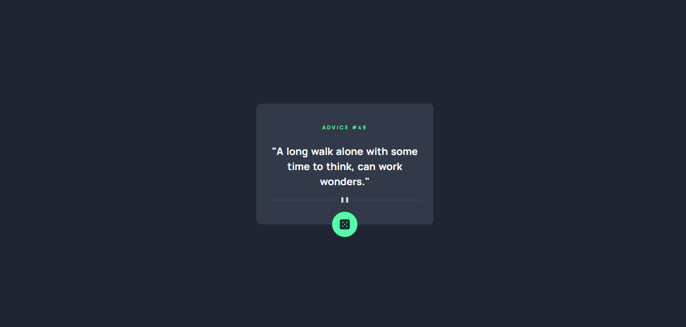
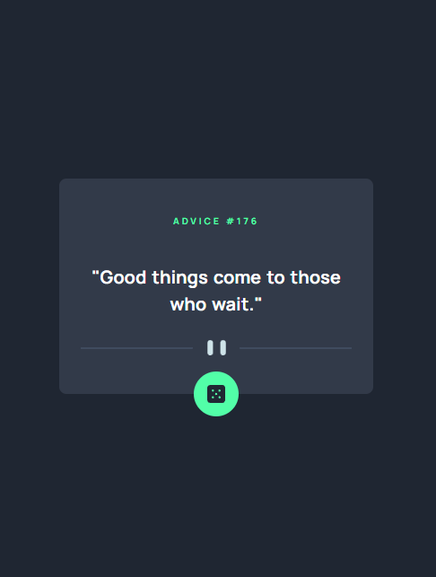

# Frontend Mentor - Advice generator app solution

This is a solution to the [Advice generator app challenge on Frontend Mentor](https://www.frontendmentor.io/challenges/advice-generator-app-QdUG-13db).

### The challenge

Users should be able to:

- View the optimal layout depending on their device's screen size.

### Solution screenshot

#### Desktop



#### Mobile




## Project Setup

```sh
npm install && npm run dev
```

### Compile and Minify for Production

```sh
npm run build
```

## Author

- Nunutria 🦦🦦🦦
- Frontend Mentor - [@Nunutria](https://www.frontendmentor.io/profile/nunutria)
- Twitter - [@nunutria_dev](https://twitter.com/nunutria_dev)

